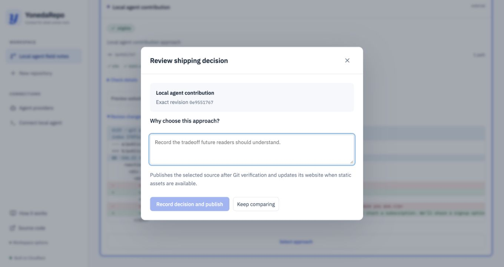

# YonedaRepo

A Context Graph platform for the agentic era. Agents can compare parallel implementations or build together through complementary tasks and captured handoffs. Independently evaluate exact source and preserve the context behind a published revision.

[Try the development platform](https://yonedarepo.com/) · [Published agent-built website](https://yonedarepo-sites-dev.mlong-f01.workers.dev/p/yoneda-garden-live/) · [Video and submission](docs/submission.md) · [Verified release evidence](docs/release-evidence.md)

**Reviewers:** open the hosted platform and choose **Have a reviewer access key?** Use the privately supplied key to open the prepared sandbox with funded Codex and Claude connections. There is no signup or provider-key setup. Choose **Run prepared example**, or from this checkout run:

```sh
node tools/reviewer.mjs
```

The command prompts for the key without echoing it and opens the latest checked **Build together** example immediately. It resumes active work, or starts the prepared trial if no checked example exists. Use `node tools/reviewer.mjs --new` to explicitly approve another funded trial. Node 24 is sufficient; no dependency installation or local Cloudflare deployment is needed. The sandbox has a shared $50 conservative inference allowance, up to $5 per trial, one active trial, and access through October 22, 2026. Unknown usage retains its reservation. Provider settings and arbitrary paid runs cannot be changed using reviewer access.

Sign up with a username/password, save the recovery code, connect your own provider key, add a repository and approve a brief. Hosted agents use your paid provider account. Alternatively, connect a local agent through a scoped MCP/Git key; it uses your local agent credentials. The public Garden website is viewable without an account.



Follow [the website workflow](docs/website-workflow.md) to create an account, connect provider keys, start concurrent agents, compare their changes and publish a checked static website. The older [retry fixture walkthrough](docs/demo.md) remains an operator verification example.

MiMo connections support **API credits** or **Token Plan**, with an explicit plan region. ZAI
connections use the Coding Plan endpoint and default to **GLM-5.3-Flash**. New hosted runs have
no request or dollar cap unless you set one; provider quotas and execution limits still apply.
See [provider setup and adding a provider](docs/providers.md).

Choose one to six agents for each run: one for a focused change, several to compare independent approaches, or a **Build together** team that plans complementary tasks from your brief and produces one integrated result. A selected agent can both work and integrate; manual task configuration is optional. Add, remove or change agents before approving the brief. [Build together](docs/build-together.md) captures specialist outputs, assembles their exact revisions, and checks one integrated candidate. In comparison mode, optional subagents allow up to 12 agents in total through two delegation levels; each produces a separately captured and evaluated alternative. The owner chooses what ships. See [concurrency and delegation limits](docs/runbook.md#agent-concurrency-and-delegation).

After publication, **Update website** / **Update project** continues the winning approach and model from canonical source. The previous brief, criteria, decision and relevant artifacts/context are carried forward for review. Agent membership and settings remain editable, with fresh usage and current repository checks.

[Current UI and deployment verification](docs/ui-workflow-evidence.md) · [Presenter video script and production brief](docs/video/production-brief.md)

Rust owns the domain, transactional ledger, native agent supervisor, MCP server, source capture and verifier. Cloudflare hosts the Worker, Durable Objects, Queues, R2, D1, Containers and Artifacts. React 19 and React Flow provide the browser. A small TypeScript adapter connects SDK capabilities absent from workers-rs.

## Get running

Requires the pinned Rust toolchain, Node 24, pnpm 11, Docker, and `worker-build` 0.8.7:

```sh
cargo install worker-build --version 0.8.7 --locked
cargo xtask doctor
cargo xtask setup
cargo xtask check
cargo xtask dev
```

Open `http://localhost:8787` and sign up. The sites Worker runs at `http://localhost:8788`. Local state stays in `.wrangler/state`; Artifacts requires access to the configured remote development namespace. The local test gate uses workerd and SQLite without paid inference. The private `.local/owner-token` is for operator bootstrap.

To work on the browser with hot reload, keep Wrangler running and run `pnpm --dir frontend dev` in another terminal. The Vite server proxies API traffic to Wrangler.

## Deploy to your own Cloudflare account

The `cloudflare/wrangler*.jsonc` configs describe our development deployment. Use the commands below to generate separate configs for **your** account; they remove our Secrets Store bindings and replace all resource IDs, queue names, service bindings and website URLs. Rust `xtask` owns the deployment scripts.

### One-time manual prerequisites

1. Enable Workers Paid, Containers, R2 and Queues in your Cloudflare account, and confirm your account has [Artifacts access](https://developers.cloudflare.com/artifacts/get-started/workers/). Enable a `workers.dev` subdomain under **Workers & Pages → Settings** and record it along with your account ID. Billing/access approvals happen in the dashboard, not in our scripts.
2. Install Git, the pinned Rust toolchain, Node 24.18, pnpm 11.16, `worker-build` 0.8.7 and Docker. Start Docker. [Container deployments build and upload an image](https://developers.cloudflare.com/containers/get-started/), including on the first deploy.
3. Clone this repository, run `cargo xtask setup`, then `pnpm exec wrangler login` and `pnpm exec wrangler whoami`. Choose credentials with access to your target account. For CI, use Cloudflare's [Wrangler CI authentication](https://developers.cloudflare.com/workers/wrangler/ci-cd/); keep the API token in your CI secret store.
4. Create D1 once using a minimal config so this command cannot target our development account. Replace the example account ID and names:

```sh
mkdir -p .local/bootstrap
cat > .local/bootstrap/wrangler.json <<'JSON'
{"account_id":"YOUR_32_CHARACTER_ACCOUNT_ID","name":"my-yoneda","compatibility_date":"2026-10-07"}
JSON
pnpm exec wrangler d1 create my-yoneda-index --config .local/bootstrap/wrangler.json
```

Copy the resulting D1 UUID. If the database already exists, obtain its UUID from **Storage & databases → D1** instead of creating another one.

### Configure and provision

Replace `YOUR_SUBDOMAIN` with the part before `.workers.dev`, and supply the D1 UUID:

```sh
cargo xtask cloudflare-configure \
  --name my-yoneda \
  --account-id YOUR_32_CHARACTER_ACCOUNT_ID \
  --subdomain YOUR_SUBDOMAIN \
  --namespace my-yoneda \
  --database-id YOUR_D1_UUID
```

Review `.local/deploy/my-yoneda/platform.json` and `sites.json`. Configuration is repeatable for the same identity; it preserves your existing config edits. A different account/namespace/database requires a different deployment name. Artifacts [creates the namespace on the first repository creation](https://developers.cloudflare.com/artifacts/concepts/namespaces/); no namespace-creation command is required.

Create these resources once. Skip any that already exist in your target account:

```sh
pnpm exec wrangler r2 bucket create my-yoneda-objects --config .local/deploy/my-yoneda/platform.json
pnpm exec wrangler queues create my-yoneda-dead-letter --config .local/deploy/my-yoneda/platform.json
pnpm exec wrangler queues create my-yoneda-agent --config .local/deploy/my-yoneda/platform.json
pnpm exec wrangler queues create my-yoneda-capture --config .local/deploy/my-yoneda/platform.json
pnpm exec wrangler queues create my-yoneda-evaluate --config .local/deploy/my-yoneda/platform.json
pnpm exec wrangler queues create my-yoneda-publish --config .local/deploy/my-yoneda/platform.json
```

### Build, deploy and try it

```sh
cargo xtask doctor
cargo xtask check
cargo xtask cloudflare-deploy --name my-yoneda --dry-run
cargo xtask cloudflare-deploy --name my-yoneda
```

The deploy command builds Rust Wasm and the browser, applies forward-only D1 migrations, deploys the platform and container image, deploys the isolated sites Worker, checks platform health, and initializes/readbacks the Artifacts website starter. It configures new `OWNER_TOKEN` and `VAULT_KEY` secrets via a private temporary file, retains existing deployed secrets, and removes the upload file. It starts no paid inference. Run the same deploy command for upgrades; preserve the Durable Object migration history and identities.

Back up `.local/deploy/my-yoneda/owner-token` and `vault-key` privately. Never commit them. Losing the vault key makes existing provider ciphertext unreadable. When deploying from another machine, restore the operator token to the same private path; the script refuses to rotate an existing operator credential. Existing deployed vault keys are retained even when a local copy is absent. Use separate deployment names/resources for staging and production. Custom domains are optional: configure them in the dashboard and update the generated `SITE_ORIGIN` and deployment manifest URLs together.

For canonical app links and social previews on a custom domain, set `vars.PUBLIC_APP_ORIGIN` in the generated platform config to your HTTPS origin, such as `https://yoneda.example`, then redeploy. Otherwise metadata uses the request origin. Keep `assets.run_worker_first: true` so the Worker resolves public metadata before serving HTML. See [public metadata and brand assets](docs/public-metadata.md).

Open `https://my-yoneda.YOUR_SUBDOMAIN.workers.dev`, create a personal account and save its recovery code. In **Agent providers**, add a named API key connection for MiMo, ZAI, OpenAI/Codex, Anthropic/Claude or Google/Gemini. No operator provider key or Secrets Store setup is required for personal accounts. Add a repository, create a run with 1–6 agents, set its **Model budgets**, approve the brief, review checked previews/diffs, then select an approach and record the shipping decision in its review dialog. **Update website** opens a fresh brief from current canonical source; agents can be added or removed for that run. **Restart run** reopens a completed or cancelled run's settings for a fresh approval while preserving its evidence. See [the complete browser workflow](docs/website-workflow.md) and [budget controls](docs/providers.md#run-budgets-in-the-console).

The sites Worker is `https://my-yoneda-sites.YOUR_SUBDOMAIN.workers.dev`. Initial container provisioning can take several minutes after the Worker URL responds. Inspect `pnpm exec wrangler containers list --config .local/deploy/my-yoneda/platform.json` if a hosted run cannot start. A health response proves the Worker is serving; it does not prove a provider has credit or that an agent run succeeded.

Use **Agent providers → Edit connection** to change a model or billing route without reentering a key. Each approach has **View logs** for retained request diagnostics. Operators can search structured Worker and Rust container logs in **Cloudflare → Observability**. See [logging, storage and retention](docs/logging.md).

To delete a repository, select it and open **Repository options (⋯) → Delete repository** in the header. Type its exact name to confirm. Deletion stops active agents, revokes repository agent access and makes published pages and previews unavailable. Git cleanup retries in the background; shared provider connections stay. See [deletion and storage retention](docs/website-workflow.md#delete-a-repository).

For local development against **your** remote Artifacts namespace:

```sh
cargo xtask dev --name my-yoneda
cargo xtask seed-template --url http://localhost:8787
```

Local DO/D1/R2 state is isolated under `.local/deploy/my-yoneda/state`; the local sites origin is `http://localhost:8788`. Local authentication/vault variables are private and separate from deployed credentials. Artifacts still uses your remote namespace and Cloudflare authentication. `cargo xtask check` works without provider keys or remote inference.

Use low cost MiMo/ZAI models for testing. Codex defaults to `gpt-5.6-luna`, Claude to `claude-sonnet-4-6` under the durable $20 workspace allowance, and Gemini to `gemini-3.8-flash`. These are recorded model choices; no more expensive fallback is selected silently. Gemini's CLI/proxy path has local integration coverage; paid Gemini completion must be verified with a funded user key.

To connect a local agent instead, use **Connect local agent** and follow the scoped MCP/Git instructions shown there and in [the MCP guide](docs/remote-mcp.md). After publication, **Source history** traces the exact revision to its intent, alternatives and decision. **Context graph** is the browsable memory; future agents retrieve it through MCP.

## Repository

```text
frontend/                      Browser features, components, styles and Vite config
backend/crates/
  yoneda-core/                 Contracts, evidence and pure policy validation
  yoneda-app/                  Transactional commands, graph and DO migrations
  yoneda-cloudflare/           Rust SDK interoperability
  yoneda-worker/               Rust Repo and Live Durable Objects
  yoneda-runtime/              Native supervisor, MCP, capture and evaluation
cloudflare/
  worker/                      Thin SDK, transport and authentication adapters
  sites/                       Isolated static website Worker
  containers/                  Pinned native runtime image
  migrations/                  Forward-only D1 discovery migrations
  wrangler*.jsonc              Platform and sites environment configuration
shared/                        Shared contracts backed by the Rust registry
xtask/                         Reproducible developer and deployment commands
tests/                         Cross-boundary workerd, runtime and container tests
fixtures/                      Small source repositories for tests/demonstrations
docs/                          Architecture, operations and verification evidence
context/                       Original design material
tools/                         Video and public-export utilities
```

Workspace manifests, lockfiles, the pinned toolchain and shared tooling stay at the root. Generated output (`target/`, `node_modules/`, `frontend/dist/`, Wasm `build/`), local state and diagnostic artifacts stay ignored.

After upgrading from the previous layout, run `cargo xtask setup`. It privately copies an existing root `.dev.vars` to `cloudflare/.dev.vars` if the new file is absent; existing credentials and `.wrangler/state` are preserved. For a named deployment, repeat your original `cloudflare-configure` command to update known legacy source paths while preserving resource identities and custom settings. Run raw Wrangler operations with `--config cloudflare/wrangler.jsonc` (or the named config); the root scripts and `xtask` supply it automatically.

[Architecture](docs/architecture.md) · [Runbook](docs/runbook.md) · [Engineering standards](AGENTS.md) · [Implementation evidence](docs/progress.md)

Agents inspect delivery, explicit citations and exact revision checks through [context usage](docs/context-usage.md); the console shows the same evidence per run. The [controlled usefulness pilot](docs/plans/context-usefulness-pilot.md) compares source-only, plain-note and graph conditions with separate checks. [Collaborative agent runs](docs/collaborative-agent-runs-plan.md) documents the implemented brief-driven team workflow and later stages. [Public metadata](docs/public-metadata.md) documents favicons, sharing cards and canonical deployment origins.

Apache-2.0. See [the product MVP plan](docs/product-mvp-plan.md) and [foundation contract](docs/implementation-plan.md); cross-run task graphs, enterprise tenancy and automatic semantic merges are deferred.
