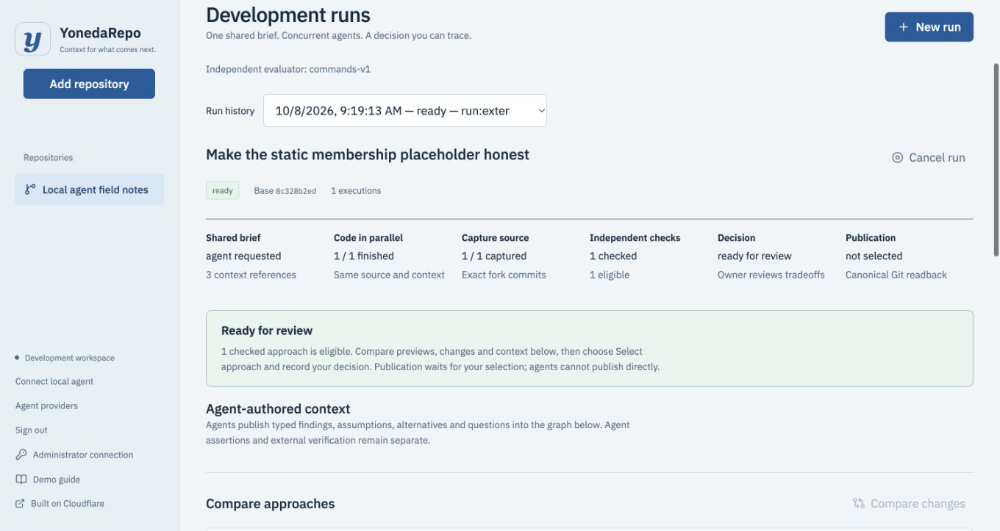

# YonedaRepo

A Context Graph platform for the agentic era. Explore parallel implementations, evaluate captured source independently, and preserve the intent, assumptions, alternatives and human decision behind a published revision.

[Try the development platform](https://yonedarepo-dev.mlong-f01.workers.dev/) · [Published agent-built website](https://yonedarepo-sites-dev.mlong-f01.workers.dev/p/yoneda-garden-live/) · [Video and submission](docs/submission.md) · [Verified release evidence](docs/release-evidence.md)

Sign up with a username/password, save the recovery code, connect your own provider key, add a repository and approve a brief. Hosted agents use your paid provider account. Alternatively, connect a local agent through a scoped MCP/Git key; it uses your local agent credentials. The public Garden website is viewable without an account.



Follow [the website workflow](docs/website-workflow.md) to create an account, connect provider keys, start concurrent agents, compare their changes and publish a checked static website. The older [retry fixture walkthrough](docs/demo.md) remains an operator verification example.

Rust owns the domain, transactional ledger, native agent supervisor, MCP server, source capture and verifier. Cloudflare hosts the Worker, Durable Objects, Queues, R2, D1, Containers and Artifacts. React 19 and React Flow provide the browser. A small TypeScript adapter connects SDK capabilities absent from workers-rs.

## Get running

Requires the pinned Rust toolchain, Node 24, pnpm 11, Docker, and `worker-build` 0.8.7:

```sh
cargo install worker-build --version 0.8.7 --locked
cargo xtask doctor
cargo xtask setup
cargo xtask check
cargo xtask dev
```

Open `http://localhost:8787` and sign up. The sites Worker runs at `http://localhost:8788`. Local state stays in `.wrangler/state`; Artifacts requires access to the configured remote development namespace. The local test gate uses workerd and SQLite without paid inference. The private `.local/owner-token` is for operator bootstrap.

To work on the browser with hot reload, keep Wrangler running and run `pnpm --dir web dev` in another terminal. The Vite server proxies API traffic to Wrangler.

## Run real agents on Cloudflare

The committed development configuration targets the project account and namespace. Read [the runbook](docs/runbook.md) before using a different account. Personal provider keys are encrypted in the workspace vault. Operator test keys use Secrets Store bindings `Codex`, `Claude`, `MiMo` and `ZAI`. Egress handlers resolve credentials; containers receive scoped proxies.

```sh
cargo xtask deploy
cargo xtask seed-template --url https://YOUR-WORKER.workers.dev
```

Use MiMo `mimo-v2.6-flash` or ZAI `glm-4.7-flash` for low cost testing. Codex defaults to `gpt-5.6-luna`; Claude uses `claude-sonnet-4-6` under a durable $20 allowance. The browser shows concurrent approaches, exact captured commits, independent checks and typed context. Review code and previews, then record a selection rationale. Selection, canonical publication and the hosted revision have distinct states.

To connect a local Codex or Claude Code agent, create a repository key in **Connect local agent** and follow [the MCP and Git instructions](docs/remote-mcp.md).

For the legacy retry fixture only, after selection and publication:

```sh
cargo xtask verify-live --url https://YOUR-WORKER.workers.dev
```

This verifies recorded live evidence and writes an ignored artifact. It does not synthesize agent results or automatically accept code. Simulated incident observations are explicitly labelled in the browser.

## Repository

```text
crates/
  yoneda-core/        Contracts, evidence and policy validation
  yoneda-app/         Transactional commands, graph and versioned DO migrations
  yoneda-cloudflare/  Rust SDK interoperability
  yoneda-worker/      Rust Repo and Live Durable Objects
  yoneda-runtime/     Native supervisor, MCP, harnesses, capture and evaluation
worker/              Focused SDK, transport and authentication adapters
sites/               Isolated static website Worker
web/src/             Browser features, components, hooks and feature styles
containers/          Pinned native runtime image
migrations/          Forward-only D1 discovery migrations
fixtures/            Small source repositories used in demonstrations
tests/workers/       Real workerd integration tests without inference
xtask/               Reproducible developer commands
docs/                Architecture, runbook and implementation evidence
context/             Original design material
```

[Architecture](docs/architecture.md) · [Runbook](docs/runbook.md) · [Engineering standards](AGENTS.md) · [Implementation evidence](docs/progress.md)

Apache-2.0. See [the product MVP plan](docs/product-mvp-plan.md) and [foundation contract](docs/implementation-plan.md); generic task DAGs, enterprise tenancy and automatic semantic merges are deferred.
