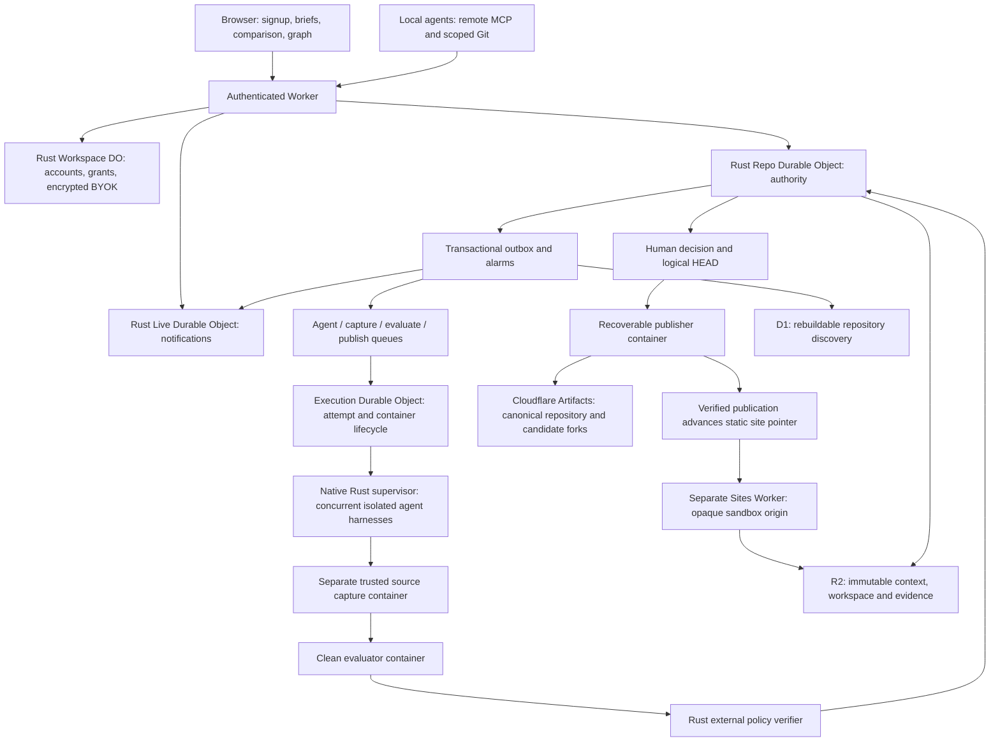

# Architecture

## Authority and storage

A repository is the unit of serialization. Its SQLite-backed DO owns intent, runs, executions, jobs, graph entities, evaluations, human decisions, logical HEAD and the publication reservation. Each command runs synchronously inside `transactionSync`; no external I/O occurs there. Events and the outbox are written in the same transaction. Alarms recover leases and drain outbox entries. D1 and Live DO never authorize a selection.

SQLite keeps repository transitions adjacent to their DO authority. D1 is also SQLite, but only a discovery projection here. PostgreSQL is a reasonable future global authority if cross-repository transactions become a requirement; adding it now would introduce another storage boundary into a Cloudflare-native per-repository design.

DO migrations carry numbered SQL files and checksum records. Wrangler migrations separately provision DO classes. D1 migrations are forward-only and use Wrangler's migration history. Generated Worker code, containers, local state, credentials and evidence exports are ignored by Git.

The workspace authority owns username/password accounts, hashed sessions, recovery, scoped repository grants and encrypted provider keys. Repository ownership is rechecked at the Worker/DO boundary. Recovery revokes existing sessions and grants. Provider encryption uses authenticated workspace/provider identity; personal workspaces have no fallback to operator credentials. Repo SQLite remains authoritative for repository state, while D1 discovery and Live notifications can be rebuilt.

## Execution and evidence

The product run starts two to four independent coding approaches with the same approved brief, base, policy and selected typed context. Provider/model choices are recorded per execution. Standard records include intent, requirement, constraint, assumption, finding, alternative, proposed decision and question. Immutable records can support, challenge, depend on or supersede prior records. Agent-authored statements remain assertions. Questions currently record context; interactive pause/answer/resume is deferred.

The older retry fixture retains its research-then-three-coders DAG for bounded verification. All receive identical frozen research artifact IDs. `provided_to` records delivery; `retrieved_by` records an actual MCP read. Neither alone proves causal influence. The generic website run does not inherit this fixture's retry requirements.

Every queue job carries a versioned envelope. Claiming creates an epoch, bounded attempt deadline and renewable lease. All callbacks and broker operations recheck the epoch. Native supervisors send heartbeats; execution DO watchdogs destroy cancelled, completed or expired containers. Attempts use distinct container IDs. Duplicate queue delivery cannot duplicate a committed outcome.

The same native binary serves stdio MCP for both harnesses. Tools expose context, scoped artifact retrieval/publication, status and completion hints. Model arguments cannot select another tenant, repository, execution or credential.

Provider traffic leaves through allowlisted virtual host handlers. The Worker resolves encrypted personal keys or operator Secrets Store bindings and injects credentials outside the container. Agents run as an unprivileged user with a cleared environment. Trusted supervisor callbacks require a separate capability unavailable to the agent process. Capture, evaluator and publisher jobs have no model capability. Requests, input/output and execution time are bounded; Claude reserves cost durably under a shared allowance before inference, and unknown usage retains the reservation.

Capture consumes bounded regular files, including binary content, and builds fresh Git objects in a separate container. It fetches the frozen parent, writes a new tree/commit and pushes a candidate fork. Agent `.git` state is never trusted. A clean evaluator builds the exact captured revision using owner-approved commands; the legacy retry build is offline, while the generic profile permits bounded npm/Cargo registry reads. Candidate output is observed data; Rust policy code outside that process determines the verdict and binds it to candidate, revision, policy, suite, environment and evidence digest.

Remote Streamable HTTP MCP uses hashed revocable read/contribute grants. Contribution attempts receive a server-derived identity, frozen base/context and isolated Artifacts fork. The scoped Git broker exposes canonical reads and active-attempt fork writes without returning Artifacts credentials. Submission fences future writes, binds the server-observed fork revision, then follows the same independent capture/evaluation pipeline. External agents have no selection/publication capability.

## Selection and publication

Acceptance checks exact candidate/evaluation identity, all required passing checks, current policy, expected HEAD/version, cancellation and absence of an unresolved publication. One transaction records a durable idempotency receipt, human rationale, considered alternatives, advances logical HEAD and creates the publisher outbox job.

Published HEAD remains the prior commit until the publisher verifies Artifacts. Publication checks ancestry, pushes with an explicit expected-old-ref lease and reads the ref back. A retry recognizes an already-published target after acknowledgment loss. Unexpected remote changes block publication rather than overwriting them. Starting a new run is blocked while publication is unresolved.

The browser surfaces **Ready for review** only for an eligible candidate against the current base and policy. The owner compares and records a shipping rationale in the product. Selection, verified canonical publication and hosted revision are separate states. A clean evaluator captures bounded static assets into an immutable R2 manifest tied to the exact source commit. Only verified Git publication advances the public site pointer. The separate sites Worker serves relative-path output with an opaque sandbox origin, no platform credentials and blocked external networking. A failed replacement leaves the previous website serving.

The history query is anchored to a captured commit and relative source path. Missing coverage is reported as unknown. Graph traversal is bounded. Incident observations preserve the original assumption and append a labelled observation; the MVP's incident inputs are simulated rather than production telemetry.
