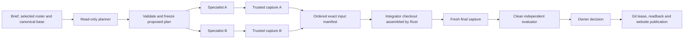

# Build together: current MVP

YonedaRepo has two frozen run modes. **Compare approaches** creates independent alternatives. **Build together** assigns complementary tasks to configured hosted agents and checks one integrated result. Existing requests without a mode retain comparison behavior.

Agents exchange typed context and exact source handoffs through scoped MCP. The console approves the brief and roster, shows progress and evidence, allows intervention, and records the owner's final publication decision. A selected agent proposes the task plan from the actual brief and source. **Advanced task plan** optionally lets the owner supply tasks and scopes directly. Plan amendments and local agents joining a hosted team remain later work in [the broader plan](collaborative-agent-runs-plan.md).

## Start a team

1. Sign in, create or select a repository, and save provider connections under **Agent providers**.
2. Choose **New run** or **Update website/project**, then **Build together**.
3. Describe what to build and select one to six agents. Add, remove or change connections before starting. With one agent, work and integration run sequentially; a selected agent can perform both roles.
4. Leave **Advanced task plan** off for brief-driven planning. The first selected agent inspects the frozen source and context without modifying files, then proposes complementary tasks, interfaces and ownership. Optionally enable the advanced editor: every draft task is removable, and one or more valid tasks are required to start a manual plan. Exact filenames or directory prefixes ending in `/` are supported; specialist scopes must be disjoint. Shared schemas and lockfiles need one designated owner.
5. Start the run. Inspect the generated plan after the planning attempt finishes. Independent ready tasks can execute concurrently; dependent tasks occupy no model container until their prerequisite source is captured. Current account/container capacity can queue otherwise ready work.
6. Inspect task source, handoff assertions, receipts and logs. After integration, review the single candidate's diff, preview and independent checks. Select it and record the publishing decision in the console.

Run policy, canonical base, roster, brief, context and budgets are frozen at creation. For automatic planning, the validated plan, interfaces and scopes freeze after successful read-only planning; a proposal or completion hint alone cannot dispatch work. Manual plans freeze at creation. To change an active plan, start a new run. Restart and published continuation retain provenance and roster; automatic runs plan again from the new brief and current canonical source. An earlier manual plan is available only through the optional advanced editor.

Publication currently hosts static frontend output in an opaque sandbox. Backend services and SQLite databases require separate deployment; a plan can produce their source and instructions but must not claim they are hosted or substitute a fake signup for a requested backend.

## Source and evidence

Each task has isolated execution and capture. Runtime assembly reads only the frozen input revisions and validates their recorded Git trees. It applies each specialist's owned delta to the canonical base in a deterministic order, including additions, deletions, binary files and executable bits. Dependent captures may include ancestor files; their own scope alone is applied as a contribution. Coding export and independent capture both enforce the current task's permitted modifications.

Specialist captures are intermediate contributions. They cannot be selected or published and do not launch per-task evaluator jobs. The integrator receives every required exact output. The final capture binds its manifest digest; independent evaluation checks that precise revision under the frozen policy. Acceptance validates the current manifest and policy. Publication retains the expected-old Git lease, ancestry and readback rules.

`task_handoff` summaries and interface descriptions are agent assertions. `team_context` delivers those assertions alongside platform-captured revision records. `integration_request` gives the designated integrator the exact manifest. Successful reads produce context usage receipts under the active job/epoch identity; model-supplied identity cannot override it. Citations can link specialist context through an intermediate capture into the checked integrated revision. These records prove delivery and source inclusion; they do not prove comprehension or general product usefulness. See [context usage](context-usage.md).

## Recovery and limits

Plans support one to 16 specialist tasks plus integration, using one to six configured agents. An agent may own several sequential tasks and later perform integration. Its slot remains reserved through source capture; terminal failure releases it for unrelated ready work. Retrying an earlier failed task waits while that same slot is busy. Automatic planning adds one read-only execution on the first selected connection; it shares that provider/model's approved limits with worker tasks and retries. No additional agent or model is introduced. Current team delegation is the explicit DAG; the compare mode's alternative-producing `delegate_agent` is disabled for team tasks.

An owner can retry a failed task, up to three task revisions, when no transitive dependent has started. Retry fences prior epochs and retains shared provider/model accounting. Completed unrelated outputs stay recorded. Active parallel work remains cancellable even if another task fails. Once a dependent starts, changing its inputs requires a new run. Cancelling stops active attempts and prevents late output from becoming authoritative.

Cloudflare Worker logs now correlate container stop requests, platform stop observations, SDK inactivity and process exit/signal metadata with job IDs and epochs. Explicitly allowlisted fields exclude credentials and raw job/provider payloads. These observations help diagnose future interruptions; they cannot retrospectively identify an old exit 143 without its lifecycle evidence.

## Implementation boundary

Rust core validates the plan. A scoped `team_plan_propose` stores an immutable agent assertion under the actual planner job/epoch. Before completion, the planner can refine its draft using the current `expected_proposal` ID; up to eight versions are retained with supersession links. Identical retries return the original record without moving the active pointer backward. Trusted runtime completion independently checks that the source is unchanged; the ledger revalidates the active draft's identity and plan before freezing it and activating tasks atomically. Cancellation or stale completion cannot activate a plan. Planner failures expose a restartable failed run. No migration beyond existing team schema **8** is required: proposals use graph nodes, tasks and handoffs use the team tables; transactional state, graph, events and outbox drive scheduling and recovery. The native runtime owns source assembly, prompts, scope checks and Git capture. Worker adapters transport scoped MCP and immutable Artifacts source. The browser projects this state and submits owner commands.

Old ledger/image versions are refused before collaborative inference. Brief-driven jobs require ledger and runtime capability `team_planning: 1`, in addition to `collaborative_runs: 1`. Deployment applies the append-only DO SQL migration lazily when repositories open. Runtime image rollout must finish before a paid acceptance run; no inference result is claimed by ordinary local tests.

See [brief-first verification](brief-first-team-verification.md) and [the earlier explicit-plan live verification](team-integration-verification.md) for the combined gates, real complementary provider work, captured handoff receipts, publication readback and observed limitations.
