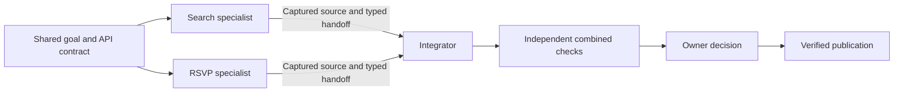

# Collaborative agent runs

Status: staged plan. The hosted MVP supports brief-driven read-only planning and an optional explicit plan; see [current behavior and limits](build-together.md). Plan amendments, repair delegation and external team participation remain future stages. Validation and deployment evidence is recorded separately.

This fits the competition's explicit interest in coordination, conflicts and preservation of why changes happened. [Cloudflare's brief](https://blog.cloudflare.com/next-git-platform-on-cloudflare/) requires concurrent agents and invites new workflows above Workers and Artifacts. A team producing one integrated result is our product interpretation of that opportunity, not a claim about judging outcomes.

## Product contract

Offer two explicit run modes:

| Mode | Agent assignment | Result presented to the owner |
| --- | --- | --- |
| **Compare approaches** (`compare`) | Each agent implements the same brief independently. | Several independently evaluated candidates; the owner chooses one. |
| **Build together** (`collaborate`) | A coordinator decomposes one goal into complementary tasks; specialists exchange evidence and an integrator combines their work. | One integrated candidate with task provenance and independent checks. |

Existing runs and requests without a mode retain comparison semantics. Freeze the chosen mode, goal, base revision, evaluation policy, provider connections and budgets when the run starts. Changing mode requires a new run. Agents are the primary operators of the team workflow; the console provides owner oversight, intervention and the final publication decision.

The first collaboration release supports one repository, one coordinator, one designated integrator, a bounded acyclic task graph and isolated hosted workers. The coordinator and integrator may be sequential roles of the same configured agent, but their runtime capabilities remain distinct. Provider defaults remain Claude `claude-sonnet-4-6` and Codex `gpt-5.6-luna`; actual model and connection choices are recorded per attempt. Run-wide spending, execution, concurrency and retry limits include planning, workers and integration.

## Current foundation and required change

[`runs.rs`](../backend/crates/yoneda-app/src/commands/runs.rs) freezes the run base and context. [`scheduling.rs`](../backend/crates/yoneda-app/src/commands/scheduling.rs) creates coding approaches. [`delegation.rs`](../backend/crates/yoneda-app/src/commands/delegation.rs) explicitly creates independent alternatives on the parent's frozen base; it does not provide a shared task backlog, task ownership or an integration result. Preserve that behavior for compare mode.

Reuse the Repo DO transaction/outbox, epoch-fenced jobs, native harnesses, scoped MCP, independent source capture, clean evaluation and conditional publication documented in [architecture](architecture.md). Extend those Rust contracts rather than placing team policy in Worker adapters. Context usage receipts provide delivery evidence and explicit citations; they do not prove a model understood or used a record. The new collaboration workflow must emit its own task and integration provenance alongside those receipts.

## Authoritative team state

Add versioned Rust contracts and an append-only DO migration for:

- **Team plan:** run ID, revision, shared goal and acceptance criteria, role assignments, task graph, integration strategy and budgets. Validate cycles, missing dependencies, graph size, role eligibility and resource limits before committing it. A coordinator can revise a plan within owner-approved bounds using an expected plan revision; changes to goal, spending ceiling or evaluation policy require owner action.
- **Task:** stable ID, purpose, acceptance criteria, dependency IDs, required typed inputs, permitted source paths, selected provider/model role and state. Start with `blocked → ready → running → capturing → complete`; insert `checking` only when the frozen policy requires a task-specific check. Failures may enter bounded `retry_wait`, `needs_revision` or terminal `failed/cancelled`. Readiness requires all declared dependency outputs at exact accepted versions.
- **Task attempt:** execution/job ID, monotonic epoch, lease, deadline, frozen input manifest, base revision and path scope. Claiming is a Repo DO transaction, so one task has one active owner. The platform assigns the task and role; model arguments cannot impersonate the coordinator, another worker or the integrator.
- **Handoff:** task and attempt IDs, immutable source revision/tree where applicable, changed paths, interface contract, findings, decisions, risks and referenced context/evidence IDs. Agent summaries are assertions. Trusted capture fills source identity; external checks fill verification status.
- **Integration manifest:** plan revision, canonical base, ordered exact task outputs, resolution records and integration attempt. Its digest binds the integrated candidate to the work it includes.

Plan changes append history. Once a task starts, its inputs are frozen. A replaced dependency invalidates its dependent outputs and any integration manifest that used them; it never silently rewrites an in-flight checkout. Independent unaffected outputs may be reused when their frozen dependency hashes and base remain valid. State, graph edges, ordered events and recovery outbox entries commit atomically.

## Isolated source and integration

Each task attempt gets its own Artifacts fork and container checkout/worktree. No two model processes write a shared mutable checkout. Independent tasks start from the same canonical base; a dependent task may start from a trusted assembled checkpoint containing its exact prerequisite outputs. The assembly manifest records that checkpoint and every constituent capture.

The coordinator proposes disjoint path ownership and explicit shared interface tasks. Workers can read the source needed for their task, but capture validates changed regular-file paths against the task's frozen write scope, including additions, deletions and renames. Overlap requires a recorded ownership amendment or an integration task. Prompts alone do not enforce ownership. Lockfiles, shared schemas and generated files have a designated owner. Reject unsafe paths and special files using the existing capture boundary.

Completed task outputs are intermediate contributions, not independently selectable final candidates in collaborate mode. Capture and scope validation are mandatory. Start with one review and independent check of the combined integration candidate; task-specific checks are optional policy requirements, and there is no per-task owner approval ritual. Task checks make outputs eligible as inputs, not proof that the whole product works. A designated integrator receives the exact input manifest and creates a combined tree from trusted captures. Use a deterministic task order and record merge resolutions. The integrator may request a bounded repair task or produce a resolution within its own frozen write scope; it cannot silently drop a required task or substitute a different revision.

Trusted capture constructs a fresh final commit rooted in the run's approved canonical base and stores the integration manifest separately. This preserves the current publication ancestry model without trusting worker `.git` metadata. A clean evaluator checks that exact final revision under the owner-approved policy, including cross-component behavior. Worker checks and an agent review cannot replace this evaluation. Build scripts remain untrusted and get no capture, provider, ledger or publication credentials.

Only the integrated candidate can become **Ready for review**. Owner acceptance must match its exact revision, evaluation, policy, plan/input manifest and expected canonical HEAD/version. Publication retains the expected-old Git ref lease and readback, including acknowledgment-loss recovery. A stale base or a changed manifest requires fresh integration and checks; never relabel earlier evidence as current.

## Agent protocol and evidence

Add small, typed scoped MCP tools, shared by native and hosted execution:

| Capability | Permitted actor | Meaning |
| --- | --- | --- |
| `team_context`, `task_status` | Assigned team members | Read the frozen goal, role, assigned task, dependency versions and bounded team status. |
| `team_plan` | Coordinator | Submit or amend the bounded DAG with an expected plan revision. |
| `task_request` | Worker/coordinator | Request work, a scope change, a repair or help; the scheduler decides ownership and eligibility. |
| `task_handoff` | Active task owner | Submit typed assertions and request trusted capture/checking of that attempt's workspace. |
| `integration_request` | Integrator | Request assembly of exact eligible task outputs and record proposed resolutions. |
| Existing context tools and `context_usage` | Scoped members | Retrieve and cite handoffs, contracts and prior decisions with truthful receipt/authority labels. |

Task assignment and renewal use trusted runtime channels. Model completion hints never directly mark a task verified. All mutations carry adapter-generated identity, epoch and stable request IDs; replay returns the committed result and conflicting reuse fails. External local agents can join in a later stage through contribution grants and server-issued sessions bound to a specific team task; a grant alone must not grant coordinator or integrator authority.

Represent `depends_on`, assignment, produced handoffs, opened inputs, explicit citations, integrated outputs and exact evaluations in the context graph. A consumer's frozen manifest distinguishes an assigned record from a successful retrieval and from a cited assertion. Every final source contribution links to its captured task revision and final integration/evaluation. Report unavailable historical usage honestly; do not infer it from task assignment or a successful build.

## Failure and recovery

- A blocked dependency waits durably without occupying a model container. Alarms/outbox delivery wake newly ready tasks after committed dependency transitions.
- Lease loss, worker crash or duplicate queue delivery follows the existing epoch fencing. Stop the old container before accepting replacement output; late callbacks and late fork writes cannot satisfy the new attempt. Retry from the same frozen inputs unless a recorded plan revision invalidates them.
- A failed task blocks its dependents. The coordinator can request a bounded retry, repair or replacement within the approved plan and budget. Exhaustion leaves an actionable failed/blocked state, not a successful partial result.
- A merge conflict becomes explicit integration work with affected paths and input revisions. No silent last-writer-wins. Resolve or send repair tasks, then capture and evaluate a new integrated revision.
- Run cancellation atomically fences task, coordinator and integration jobs and records stop intents. Durable cleanup destroys containers and revokes fork capabilities even after lost acknowledgments. Preserve completed evidence; prevent late outputs from restarting work or becoming publishable.
- Recovery after DO eviction or dispatch acknowledgment loss reconstructs ownership, dependencies and pending work from SQLite. Source assembly and capture requests use stable manifests/idempotency keys. Publisher retries retain the existing conditional-ref/readback behavior.

## Console experience

Run creation presents **Compare approaches** and **Build together**, with clear result descriptions. Collaboration configuration selects the coordinator, available specialists, integrator and bounded team budget. Avoid asking the owner to manually dispatch each task.

The run view shows the shared goal, task DAG, current task owner/attempt, dependency blockers, handoffs, context access and spending. Show source paths and interfaces for each task, plus concise failure/retry/conflict states. Provide cancel, bounded retry and owner-requested plan changes with optimistic version checks. Live updates are notifications; authoritative state comes from the Repo DO.

Replace competing candidate cards with a single integration view: included task revisions, unresolved conflicts, independent checks, preview, changed files and publication status. Preserve the distinction between task completed, integrated, independently checked, owner selected and published. Keyboard-accessible task details and explicit empty/loading/error/reconnecting states are required.

## Demonstration and acceptance

The initial demonstration used two specialists for event search and RSVP, with a third integrator. That example is historical evidence, not a run preset. Current runs derive complementary tasks from the actual brief, selected roster and source. One to six agents are configurable, and a worker may also integrate; external participants and plan amendments remain later stages.

Use a disposable event-registration website with one brief: add searchable events, accessible registration and a persistent registration summary. The coordinator creates an interface/schema task, then parallel catalog/filter and registration-form tasks, followed by a summary task dependent on the registration contract. Assign specialists complementary paths; the integrator assembles one functioning website. An independent evaluator exercises filter → registration → summary and keyboard/error behavior against the exact final commit.

Show the actual task graph and overlapping worker execution, one typed contract handoff retrieved by a dependent agent, and one final combined candidate. Inject a clearly labelled worker lease loss and shared-interface conflict; demonstrate fenced late output, bounded retry, recorded resolution and fresh integration checks. Finish with explicit owner selection, conditional Git publication and published revision readback. Report paid live inference separately from local fixtures and do not call an automated fixture selection user acceptance.

Use the context evidence chain to show the handoff's origin, assigned recipient, actual retrieval, explicit citation, included task revision and final checked behavior. A receipt alone proves delivery. A controlled comparison with the same source and missing handoff is a separate usefulness experiment, following the [pilot plan](plans/context-usefulness-pilot.md); it is not required to publish a correctly checked product change.

## Staged implementation

1. **Contracts and ledger:** add explicit modes, role/task/plan/manifest schemas, versioned migration and deterministic native command tests. Cover duplicate claims, cycles, stale plan edits, dependency invalidation, rollback and upgrade/repeat migration. Preserve all existing compare semantics.
2. **Hosted team execution:** add coordinator/worker task tools, lease-backed scheduler and typed handoffs. Implement capture-enforced path scopes and trusted dependency checkpoints. Workerd tests cover outbox replay, eviction, lost acknowledgments, cancellation and late callbacks; local fake harnesses prove orchestration without provider keys.
3. **Integration and eligibility:** add manifest-driven assembly, scoped integrator repair and independent final checks. Test conflicting edits, omitted/stale task outputs, malicious files/build scripts, stale canonical HEAD and publisher acknowledgment loss. Reject owner acceptance of intermediate task outputs.
4. **Console and real demo:** implement the team views and inspect them in the served app, including blocked/failed/reconnecting states. Run the full local gate, then an explicitly authorized bounded live demonstration and preserve source, deployment, run and publication evidence separately.
5. **External participants:** bind remote MCP sessions and contribution forks to eligible team tasks with the same roles, leases, receipts and capture boundary. Test revoked grants, cross-task attempts, session rebinding and concurrent hosted/local work before enabling this path.

Each stage must leave the existing setup commands and comparison workflow usable. Document schema and Worker/container deployment ordering and version capabilities so mixed deployments fail closed. Keep coordination policy in focused Rust modules and transport/browser code thin; the plan does not require a new global database or a shared filesystem service.
