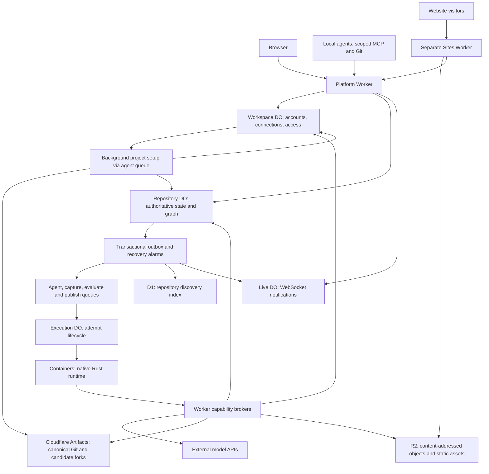

# YonedaRepo current-state architecture

Source snapshot: October 9, 2026. This document describes the current code and Cloudflare
configuration. Deployment and live acceptance evidence are recorded separately in
[UI workflow evidence](ui-workflow-evidence.md).

YonedaRepo has four main parts: a React frontend, a Rust application core, Cloudflare services
for coordination and storage, and isolated containers for native agent execution.

## Code layout

```text
frontend/                  React, TypeScript, Vite and React Flow
backend/crates/
  yoneda-core/             Types, contracts, validation and provider registry
  yoneda-app/              Transactional state, graph, scheduling and migrations
  yoneda-cloudflare/       Rust-to-Cloudflare binding adapters
  yoneda-worker/           Rust Durable Objects compiled to Wasm
  yoneda-runtime/          Native supervisor, MCP, capture, evaluation and publication
cloudflare/
  worker/                 Authentication, HTTP/MCP/Git and SDK adapters
  sites/                  Separate Worker serving published static websites
  containers/             Pinned native runtime Docker image
  migrations/             Forward-only D1 discovery migrations
  wrangler*.jsonc         Cloudflare deployment configuration
shared/                   Provider contracts shared with TypeScript
xtask/                    Setup, checks, builds and deployment commands
tests/                    Workers, runtime and container integration tests
fixtures/                 Small source repositories for tests and demonstrations
docs/                     Architecture, operations and verification
context/                  Original design material
tools/                    Video production and public-source export utilities
```

Workspace manifests, lockfiles and the pinned toolchain stay at the root. Generated builds,
credentials, local state and diagnostic exports are ignored by Git.

## Application boundaries

| Layer | Responsibility | Entry points |
|---|---|---|
| Browser | Accounts, provider connections, run configuration, previews, diffs, decisions, graph and history | [App](../frontend/src/App.tsx), [repository state](../frontend/src/hooks/useRepository.ts) |
| Rust contracts | Typed context, provider descriptors, agent limits, source and evaluation validation | [yoneda-core](../backend/crates/yoneda-core/src/lib.rs) |
| Rust application | Run creation, scheduling, leases, context, capture results, verification, decisions and publication state | [yoneda-app](../backend/crates/yoneda-app/src/lib.rs), [command dispatch](../backend/crates/yoneda-app/src/commands/mod.rs) |
| Cloudflare binding adapter | Implements the storage interface and bridges SDK operations | [yoneda-cloudflare](../backend/crates/yoneda-cloudflare/src/lib.rs) |
| Rust Durable Objects | Repository authority, workspace authority, recovery alarms and live notifications | [yoneda-worker](../backend/crates/yoneda-worker/src/lib.rs) |
| Worker transport | Authentication, HTTP routes, remote MCP/Git, container lifecycle and credential injection | [Worker entrypoint](../cloudflare/worker/index.ts), [routes](../cloudflare/worker/routes.ts) |
| Native execution | Tokio/Axum supervisor, agent CLI harnesses, stdio MCP, source capture, clean evaluation and Git publication | [yoneda-runtime](../backend/crates/yoneda-runtime/src/lib.rs) |

The browser submits commands and displays recorded state. Rust owns authoritative repository
transitions. The application uses the same commands with native SQLite in local tests and
Durable Object SQLite in Cloudflare. TypeScript connects Cloudflare SDK capabilities,
authentication and provider protocols to those commands.

Repository discovery also returns the authenticated account identity. The header displays the
personal username or an explicit Administrator label and provides sign-out. Anonymous visitors
can open username/password sign-in directly; administrator token access remains a separate flow.

## Cloudflare service architecture



The platform Worker serves the browser assets and handles `/api`, `/mcp` and `/git`. The sites
Worker serves published static output on a separate origin and reads the verified site pointer
through an internal service binding.

| Component | Current role |
|---|---|
| Workspace DO (`WorkspaceAuthority`) | Accounts, hashed sessions, recovery, encrypted provider connections, access grants, project setup leases/stages, durable dispatch intent and workspace allowances. |
| Repository DO (`RepositoryAuthority`) | Runs, executions, jobs, graph nodes/edges, evaluations, decisions, logical HEAD and publication state. SQLite is authoritative. |
| Live DO (`LiveRoom`) | Hibernating WebSocket connections and payload-free refresh signals. Clients reauthenticate when fetching data. |
| Execution DO (`ExecutionContainer`) | Stores one attempt's scope and manages its container, watchdog, startup and cancellation. This adapter uses the TypeScript Container SDK. |
| Queues | Separate dispatch queues for agent, capture, evaluate and publish work, with a dead-letter queue. Project provisioning also uses the agent queue and does not start a model or container. |
| Containers | Run the native Rust supervisor and agent CLIs. Coding, capture, evaluation and publication run with separate capabilities. The current configuration allows 16 instances. |
| Artifacts | Canonical Git repositories and isolated candidate forks. |
| R2 | Immutable context objects, workspace snapshots, transcripts, verification evidence and static asset manifests. |
| D1 | Rebuildable repository discovery projection. It does not authorize selection or publication. |
| Sites Worker | Serves checked static assets after verified canonical publication. |
| Observability | Structured operational Worker/container logs. Safe owner-visible execution timelines also persist in Repository DO SQLite. |

There is no separate Task DO. Runs and jobs live inside the Repository DO. Scheduling uses a
custom Rust state machine, transactional outbox, queues, leases and recovery alarms.

## State and recovery

A repository is the unit of serialization. State, graph changes, ordered events and pending
outbox work commit in one synchronous transaction, without network I/O. Outbox delivery then
dispatches jobs, updates D1 and notifies the Live DO. Alarms recover expired leases and retry
pending delivery.

Queue delivery can repeat. Each active attempt has a server-derived identity and epoch;
callbacks and capability brokers check that epoch before accepting work. Cancellation and
expiry fence the attempt and stop its container.

Durable Object SQL migrations live beside `yoneda-app`. Cloudflare class migrations remain in
Wrangler configuration, and D1 migrations live in `cloudflare/migrations`. These are separate
migration histories with stable resource identities.

## Development workflow

Signup and login create an opaque session backed by Workspace DO SQLite. Project creation
reserves a stable ID there, schedules background setup and returns promptly. A Workspace DO
alarm retains dispatch intent and retries queue sends, pending imports and expired claims,
even when the browser is closed or a queue acknowledgment is lost. Idle workspaces stop their
alarm. Browser polling reads recorded stages without starting parallel Artifacts imports.
Setup claims have a
two-minute lease and epoch; an attempt has a 90-second watchdog, and repeated pending work
stops after ten minutes. Failed setup can retry with the same repository identity.

Accounts accept a username or practical ASCII email as the registered identifier, trimmed and
case-insensitive. Email dots and plus tags are preserved. Encoded cookie/MCP segments prevent
email punctuation from becoming protocol separators; legacy username sessions and grants keep
their original format. The Rust core owns validation and shared contract cases check browser
and Worker parity. Existing usernames do not acquire an email alias automatically. Email
ownership verification and email-based password reset are not implemented; recovery uses the
one-time saved code.

Imports resolve the public Git remote's advertised HEAD and explicitly supply its branch to
Artifacts. Existing imports with incorrect default-branch metadata recover the actual source
branch before initialization. Empty or unsupported source produces an actionable error.
Artifacts operations remain asynchronous; see the
[Cloudflare import guide](https://developers.cloudflare.com/artifacts/guides/import-repositories/).
The UI displays elapsed time, stage, errors and retry controls. Browser API requests have a
20-second timeout; mutations are not automatically repeated after an uncertain response.
Initial setup events go to
Cloudflare Workers Logs without passwords, Git capabilities or source contents.

The comparison flow is below. [Build together](build-together.md) starts with brief-driven
read-only planning on the first selected connection, or an optional manual plan. Its scoped
proposal is an agent assertion; trusted unchanged-source completion and ledger validation freeze
the task DAG before work starts. One to six selected agents can share worker and integrator roles.
Disjoint specialist write scopes, captured handoffs and deterministic Rust source assembly apply.
Only its final integration receives independent evaluation and owner publication; intermediate
source never becomes a selectable candidate. Repo DO migration 8 stores this team state.

1. The owner approves a brief, source base, context, agent roster and model limits.
2. In comparison mode, agents work independently from the same frozen base and publish typed context through MCP.
3. A separate capture job validates regular files and constructs fresh candidate Git objects.
4. A clean evaluator checks the exact captured revision against the approved policy.
5. The owner compares eligible candidates and records a shipping decision and alternatives.
6. Publication verifies ancestry, updates canonical Git with an expected-old-ref lease and
   reads it back. Verified publication advances the hosted static site pointer.
7. Later updates carry forward the published approach, decision and selected context for review.

Runs accept one to six initial agents. Optional delegation allows up to 12 total agents through
two delegation levels. Children inherit approved provider, model, source and context; each
produces an independently captured and evaluated candidate. Agent membership is editable
before run approval and frozen afterward.

`continuation_of` connects a new update to the decision at the current published commit.
Restarting a run creates a new approved attempt while retaining the earlier evidence.
Selection, canonical Git publication and hosted site state remain separately recorded.

## Context graph and agent access

The graph resides in Repository DO SQLite as typed nodes and edges. It joins intent, runs,
agent assertions, artifacts, executions, candidates, evaluations, decisions and source
revisions. Agent assertions remain distinct from independent checks and human decisions.

The browser uses React Flow to explore the graph. The full view consumes fresh repository
snapshots on live notifications, with a three-second polling fallback. Submitted searches and
expanded neighborhoods currently retain their query results until requested again. Historical
queries are anchored to a specific source revision and path; graph traversal is bounded.

Hosted agents use the native stdio MCP server. External agents use Streamable HTTP MCP and
revocable repository-scoped grants. Scoped Git reads and contribution writes go through the
Worker without exposing Artifacts credentials. External contributions enter the same capture
and evaluation pipeline, with owner selection required for publication.

## Providers and credentials

The single provider registry lives in
[yoneda-core/src/providers.json](../backend/crates/yoneda-core/src/providers.json) and is
consumed by Rust, the Worker and browser through `shared/providers.ts`. Current providers are
OpenAI/Codex, Anthropic/Claude, MiMo, ZAI and Gemini. Harnesses are Codex, Claude Code and Gemini
CLI; a provider's protocol selects the compatible harness and egress adapter.

Personal provider keys are encrypted for their workspace. Operator keys use Cloudflare Secrets
Store bindings. The Worker resolves and injects credentials into allowlisted upstream requests;
agent processes do not receive the provider keys. Saved connections determine billing route,
model and region. Request and dollar caps are optional for new runs; execution duration,
response bounds, provider quotas and the Claude workspace allowance still apply.

## Local development and deployment

`cargo xtask` coordinates setup, checks, native/Wasm and browser builds, local servers and
deployment. Local integration tests use real workerd Durable Objects, SQLite and R2 without
paid inference. The same runtime binary runs in the pinned Linux container image.

See [README setup and deployment](../README.md), [runbook](runbook.md),
[provider configuration](providers.md), [MCP guide](remote-mcp.md) and
[logging](logging.md) for operational details.

Cross-run task graphs, automatic semantic merges, interactive question/answer/resume and hosting
arbitrary application backends are outside the current MVP. Current publication serves static
website output.
